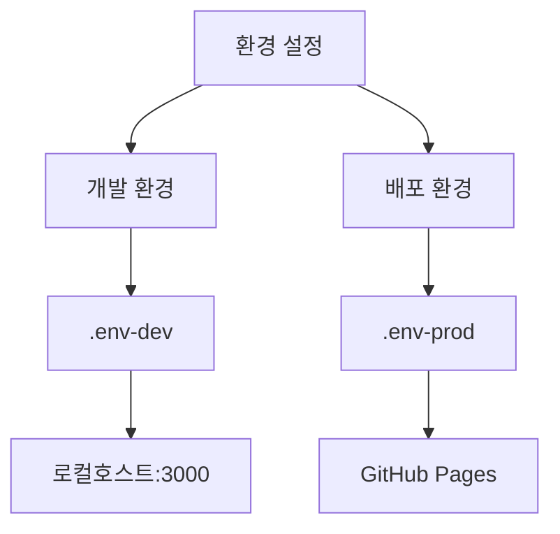

# 🎯 JBNU 웹서비스설계 과제4 :: 카카오 로그인 구현

<div align="center">


</div>

## 📌 프로젝트 개요
본 프로젝트는 웹서비스 설계 과제2에서 구현했던 넷플릭스 클론 사이트 만들기를 기반으로
**`카카오 로그인`** 을 구현한 과제입니다.

주요 기능은 과제2를 그대로 유지하고 있으며, 본 과제에서는
1. 🔑 카카오 로그인
2. 🔄 개발-배포 환경 구분

위 두개가 주 내용인 만큼 해당 내용 위주로 설명을 하고자합니다.

---

## 🚀 프로젝트 시작하기

```bash
# 프로젝트 클론
git clone https://github.com/YourUsername/WSD-Assignment-04.git

# 프로젝트 폴더로 이동
cd WSD-Assignment-04

# 의존성 패키지 설치
npm install

# 개발 서버 실행
npm run start:dev

# 또는 프로덕션 서버 실행
npm run start:prod
```

> **Note**: 실행하기 전에 `.env` 파일에 필요한 API 키가 설정되어 있는지 확인해주세요.

---

## 💡 주요 구현 기능

### 1. 카카오 로그인 구현 ✅

<details>
<summary><b>1.1 카카오 SDK 통합</b></summary>

- 🔹 카카오 JavaScript API 키 기반으로 구현
- 🔹 AuthForm.tsx에서 SDK 초기화 및 관리
- 🔹 해시 라우팅 기반 구현
- 🔹 네트워크 및 CORS 에러 처리
</details>

<details>
<summary><b>1.2 로그인 프로세스</b></summary>

```typescript
window.Kakao.Auth.login({
  scope: 'profile_nickname, account_email',
  success: function(authObj: any) {
    // 인증 성공 처리
    localStorage.setItem('kakaoAccessToken', authObj.access_token);
  },
  fail: function(error: any) {
    // 에러 처리
    console.error('카카오 로그인 실패:', error);
  }
});
```
</details>

<details>
<summary><b>1.3 사용자 프로필 관리</b></summary>

- 🔹 프로필 정보 조회 (ID, 이메일, 이름)
- 🔹 localStorage를 통한 데이터 저장
- 🔹 세션 관리 구현
</details>

## 📋 평가 기준 달성 현황

### 1. 핵심 기능 평가 항목 ✅

| 번호 | 평가 항목 | 구현 | 검증 내용 |
|------|-----------|:----:|-----------|
| 1 | 카카오 로그인 구현 | ✓ | `window.Kakao.Auth.login()` 구현 및 정상 작동 |
| 2 | 메인 페이지 자동 리디렉션 | ✓ | `navigate('/', { replace: true })` 구현 |
| 3 | 프로필 이름 헤더 표시 | ✓ | `userInfo.name` 저장 및 Header.tsx 파일에 표시 구현 |
| 4 | 회원 정보 조회 및 콘솔 출력 | ✓ | `console.log('로그인한 카카오 사용자 정보:', userInfo)` 구현, `User.tsx`에 프로필 구현 |
| 5 | 새로고침 시 로그인 유지 | ✓ | `localStorage` 활용하여 상태 유지 |
| 6 | 로그아웃 기능 | ✓ | 세션 및 토큰 정리 로직 구현, 로그아웃시 프로텍트 레이아웃 기능으로 signin페이지로 이동 |
| 7 | UI 분기 처리 | ✓ | `isLoggedIn` 상태에 따른 조건부 렌더링 |
| 8 | 로그인 실패 에러 메시지 | ✓ | `toast.error()` 활용한 에러 처리 |
| 9 | API 예외 처리 | ✓ | 다양한 에러 코드별 처리 구현 |
| 10 | 네트워크 오류 피드백 | ✓ | 네트워크 상태별 사용자 피드백 구현 |

### 2. 추가 평가 기준 ✅

| 번호 | 평가 항목 | 구현 | 검증 내용 |
|------|-----------|:----:|-----------|
| 1 | .env 파일 구성 | ✓ | .env-dev/.env-prod 분리 구현 |
| 2 | TMDB API Key 관리 | ✓ | `REACT_APP_TMDB_API_KEY` 환경변수 사용 |
| 3 | 카카오 API Key 관리 | ✓ | `REACT_APP_KAKAO_API_KEY` 환경변수 사용 |
| 4 | GitHub API 키 보안 | ✓ | GitHub Actions secrets 활용 |
| 5 | 환경별 스크립트 구분 | ✓ | package.json에 start:dev/prod, build:dev/prod 구분 |
| 6 | 토큰 저장소 관리 | ✓ | `localStorage.setItem('kakaoAccessToken', authObj.access_token)` 구현 |
| 7 | .gitignore 설정 | ✓ | 환경 변수 파일 포함 확인 |
| 8 | 배포 플랫폼 동작 | ✓ | Github actions 기반 GitHub Pages 정상 작동 : https://highcastle01.github.io/WSD-Assignment-04 |
| 9 | 환경 전환 원활성 | ✓ | env-cmd 활용한 환경 전환 구현 |
| 10 | CORS 이슈 해결 | ✓ | 적절한 CORS 설정 및 에러 처리 구현 |

### 구현 특이사항 🔍

1. **에러 처리 세분화**
```typescript
if (error.code === -401) {
  toast.error('인증이 만료되었습니다. 다시 로그인해주세요.');
} else if (error.code === -502) {
  toast.error('서버 연결에 실패했습니다. 잠시 후 다시 시도해주세요.');
} else if (error.code === -504) {
  toast.error('서버 응답 시간이 초과되었습니다. 네트워크 상태를 확인해주세요.');
}
```

2. **환경 구분 스크립트(package.json)**
```json
"scripts": {
  "start:dev": "env-cmd -f .env react-scripts start",
  "start:prod": "env-cmd -f .env-prod react-scripts start",
  "build:dev": "env-cmd -f .env react-scripts build",
  "build:prod": "env-cmd -f .env-prod react-scripts build"
}
```

3. **보안 처리**
- GitHub Actions secrets 활용
- 환경변수 파일 분리
- API 키 보안 처리

#### 2.2 환경 설정 및 보안 🔒



### 3. 환경 설정 상세 ⚙️

<details>
<summary><b>3.1 개발 환경 (.env-dev)</b></summary>

```env
IP_ADDRESS=localhost
PORT=3000
REACT_APP_TMDB_API_KEY=[보안]
REACT_APP_KAKAO_API_KEY=[보안]
PUBLIC_URL=.
REACT_APP_HOMEPAGE=http://localhost:3000
REACT_APP_CLIENT_VERSION=0.0.1
```
</details>

<details>
<summary><b>3.2 배포 환경 (.env-prod)</b></summary>

```env
IP_ADDRESS=localhost
PORT=4000
REACT_APP_TMDB_API_KEY=[보안]
REACT_APP_KAKAO_API_KEY=[보안]
PUBLIC_URL=https://highcastle01.github.io/WSD-Assignment-04
REACT_APP_HOMEPAGE=https://highcastle01.github.io/Wsd-Assignment-04
REACT_APP_CLIENT_VERSION=0.0.1
```
</details>

### 4. 보안 고려사항 🔐

- 🔒 GitHub Actions secrets에 API 키 저장
- 🔒 환경변수 보안 처리
- 🔒 배포 시 민감 정보 보호

### 5. 추가 특징 🌟

- ⭐ TypeScript 완벽 구현
- ⭐ 종합적인 에러 처리
- ⭐ 반응형 UI 디자인
- ⭐ 크로스 브라우저 호환성

### 6. 기술 스택 🛠️

<div align="center">

| 기술 | 버전 |
|------|------|
| React | ^18.3.1 |
| React DOM | ^18.3.1 |
| React Kakao Login | ^2.1.1 |
| React Router DOM | ^6.20.0 |
| React Toastify | ^10.0.6 |
| TypeScript | ^4.9.5 |

</div>
